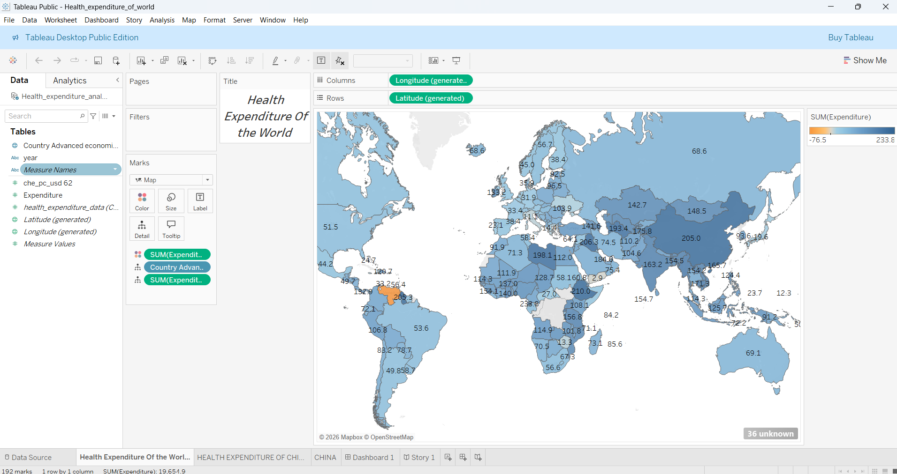
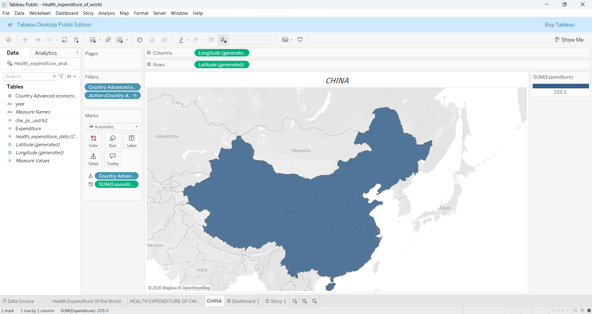
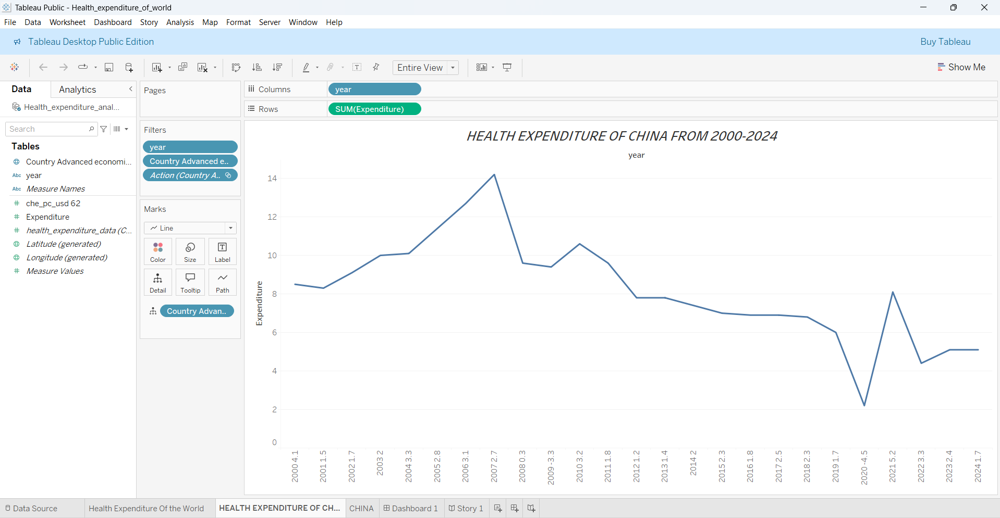
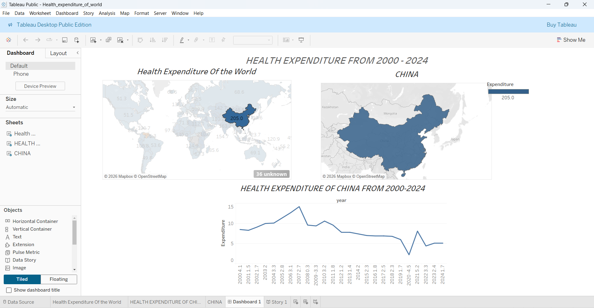
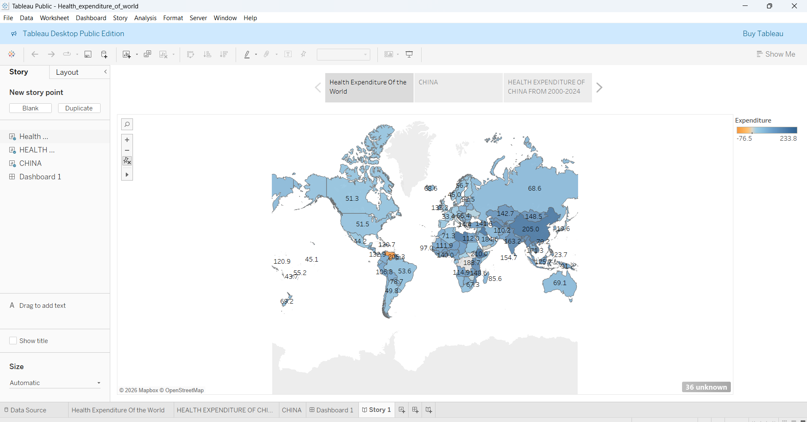

# 🌍 Health Expenditure Analysis of the World (2000–2024)

## 📌 Project Overview

This project presents an interactive Tableau dashboard and story that analyze global health expenditure trends from **2000 to 2024**. The analysis highlights healthcare spending patterns across countries, enables country-level exploration, and identifies nations with the highest health expenditure.

The dashboard reveals that **China ranks 1st in total health expenditure** among the countries included in the dataset and provides a detailed trend analysis of China's healthcare spending over the years.

---

## 🎯 Objectives

- Analyze global health expenditure across countries.
- Compare healthcare spending levels worldwide.
- Identify countries with the highest and lowest health expenditures.
- Explore historical expenditure trends from 2000–2024.
- Provide an interactive storytelling experience using Tableau Story.

---

## 🛠️ Tools & Technologies

- **Tableau Public**
- Data Visualization
- Geographic Mapping
- Dashboard Design
- Storytelling with Data

---

## 📊 Dashboard Components

### 1️⃣ Global Health Expenditure Map
- Interactive world map displaying health expenditure by country.
- Color intensity represents expenditure levels.
- Enables quick comparison of healthcare spending across regions.

### 2️⃣ Country Analysis
- Interactive drill-down analysis for selected countries.
- Geographic visualization highlighting the selected country.
- Displays expenditure values for focused analysis.

### 3️⃣ China Health Expenditure Trend (2000–2024)
- Time-series line chart showing annual health expenditure trends.
- Tracks growth, fluctuations, and long-term healthcare investment patterns.
- Highlights China's position as the leading country in expenditure.

### 4️⃣ Interactive Dashboard
- Combines global map, country view, and trend analysis.
- Supports user interaction through filters and actions.
- Provides a centralized view of healthcare spending insights.

### 5️⃣ Tableau Story
- Guides users through the analysis step-by-step.
- Presents insights in a structured storytelling format.
- Enhances understanding of global healthcare expenditure patterns.

---

## 🔍 Key Insights

- China recorded the highest health expenditure among analyzed countries.
- Significant differences exist in healthcare spending across regions.
- Developed economies generally exhibit higher expenditure levels.
- Health expenditure trends reveal changing healthcare priorities over time.
- Interactive visualizations enable deeper exploration of country-specific patterns.

---

## 📈 Business Value

This analysis can help:

- Government agencies evaluate healthcare investment trends.
- Researchers study global healthcare expenditure patterns.
- Policymakers compare healthcare spending across nations.
- Analysts identify long-term expenditure growth opportunities.
- Organizations make data-driven healthcare decisions.

---

## 📂 Project Structure

```bash
Health-Expenditure-Analysis/
│
├── Dataset/
│   └── GHED_data.XLSX
│
├── Tableau Workbook/
│   └── Health_expenditure_of_world.twb
│
├── Screenshots/
│   ├── world_health_expenditure_map.png
│   ├── china_health_expenditure_map.png
│   ├── china_trend_analysis.png
│   ├── dashboard.png
│   └── story.png
│
└── README.md
```

---

## 📸 Visualizations Included

- 🌍 World Health Expenditure Map



- 🇨🇳 China Health Expenditure Geographic View



- 📈 China Health Expenditure Trend (2000–2024)



- 📊 Interactive Dashboard



- 📖 Tableau Story Presentation



---

## 🚀 How to Use

1. Open the Tableau Workbook (`.twb`) file.
2. Explore the World Health Expenditure map.
3. Select countries for detailed analysis.
4. Review China's expenditure trend from 2000–2024.
5. Navigate through the Tableau Story for guided insights.

---

## 💡 Skills Demonstrated

- Tableau Dashboard Development
- Data Visualization
- Geographic Analysis
- Interactive Dashboard Design
- Storytelling with Data
- Trend Analysis
- Business Intelligence
- Data Interpretation

---

## 👨‍💻 Author

**Mallareddygari Gayathri**

AI/ML Engineer | Data Analyst | Business Intelligence Enthusiast

### Tech Stack
`Tableau` `Data Analytics` `Business Intelligence` `Data Visualization` `Storytelling`

---

⭐ If you found this project useful, consider giving it a star!